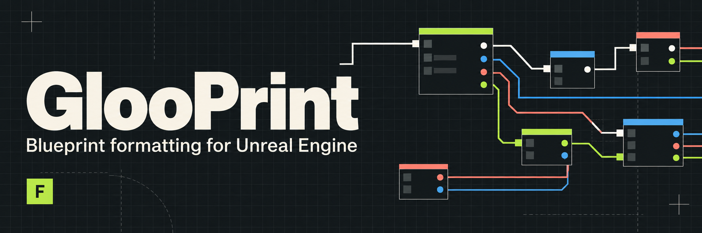

GlooPrint formats the entire active graph, including disconnected groups. Execution flow runs through columns, and the calculations feeding a node stay nearby. Whenever you format, the selection, camera position, and zoom stay where you leave them. Other graphs in the Blueprint stay untouched.

You can switch between rounded 90-degree wires, 45-degree turns, and Unreal's own splines. Custom wires update as you work, route around nodes and comment titles, and keep parallel connections apart where there's room.

We still get Unreal's pin colors, hover feedback, and execution highlights. Wire gestures and double-clicking to add a reroute work on the visible wires. You can format Event Graphs, functions, macros, Construction Scripts, opened collapsed graphs, and graphs made entirely of pure calculations. That also includes an Animation Blueprint's ordinary Event Graph.

I'm developing and testing GlooPrint with **Unreal Engine 5.8.1 on Apple Silicon Macs**. It's still in development.

The Windows source port targets **UE 5.8.2 Win64** and preserves Mac support. The Windows Editor module compiles and links with this engine version; interactive editor behavior still requires confirmation.

To install from source, place this folder under your C++ project's `Plugins/glooprint`, build the Editor target through Rider, and enable GlooPrint in Unreal's Plugins browser. Restart the editor if prompted. With a supported Blueprint graph focused, press **F** or use **Format Graph** in its context menu. Formatting and wire style settings are under **Editor Preferences > Plugins > GlooPrint**; the shortcut can be rebound in Keyboard Shortcuts.
